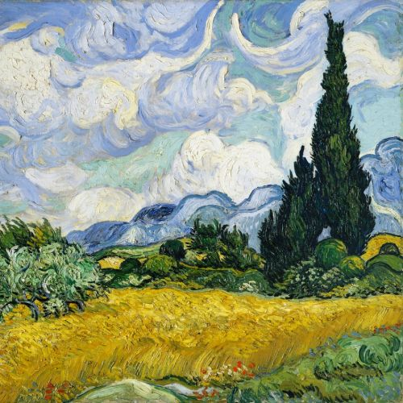

# Neural Style Transfer Project

This repository develops tools that perform neural style transfer on digital contents, one for images and the other for videos. The project utilizes image style transfer techniques to transfer the style of a given image onto another image or a video, which is an implementation of the original neural style transfer [paper](https://www.cv-foundation.org/openaccess/content_cvpr_2016/papers/Gatys_Image_Style_Transfer_CVPR_2016_paper.pdf) by Gatys et al..

## Table of Contents

- [Neural Style Transfer Project](#neural-style-transfer-project)
  - [Table of Contents](#table-of-contents)
  - [Introduction](#introduction)
  - [Installation](#installation)
  - [Usage](#usage)
    - [Image Style Transfer](#image-style-transfer)
    - [Video Style Transfer](#video-style-transfer)
  - [Project Structure](#project-structure)
  - [Examples](#examples)
    - [Group 1: Style Variation with the Same Content Image](#group-1-style-variation-with-the-same-content-image)
    - [Group 2: Content Variation with the Same Style Image](#group-2-content-variation-with-the-same-style-image)
  - [Contributing](#contributing)
  - [Acknowledgements](#acknowledgements)
  - [License](#license)

## Introduction

Neural style transfer on images begins with using a pre-trained deep neural network, known as VGG19, to extract style and content information from the input images. By preserving the content features from the content image and the style features from the style image, a new image is generated that exhibits the content of the content image in the style of the style image in a visually appealing way. This process leverages the power of convolutional neural networks and iterative optimization algorithms to achieve impressive artistic transformations.

**Note: Articulate Artistic Style**

For the best performance and visually appealing results, it is recommended to choose style images that exhibit a highly articulate and distinct artistic style. The neural style transfer algorithm relies on capturing and transferring the artistic characteristics present in the style image onto the content image. Therefore, the style image should have a clear and distinct artistic style that can be easily captured by the algorithm.

Here are some examples of style-transferred images along with their original content and style images where the style images all exhibit a highly articulate artistic style:

<p align="center">
    
</p>
<p align="center">
    
    
</p>

----------------

<p align="center">
    
</p>
<p align="center">
    
    
</p>

----------------

<p align="center">
    
</p>
<p align="center">
    
    
</p>

Furthermore, we extend the neural style transfer technique to videos. Built on top of neural style transfer for images, video style transfer involves splitting the video into frames, applying image style transfer on each frame, and subsequently synthesizing the transferred frames to reconstruct the video so that it has a visually pleasing artistic transformation.

The following examples demonstrate the video style transfer process:

<p align="center">
    
</p>
<p align="center">
    
    
</p>

----------------

<p align="center">
    
</p>
<p align="center">
    
    
</p>

## Installation

To run the neural style transfer project, follow these steps:

1. Clone the repository:

   ```bash
   git clone https://github.com/your-username/neural-style-transfer.git
   ```

2. Navigate to the project directory:

   ```bash
   cd neural-style-transfer
   ```

3. Install the required dependencies:

   ```bash
   pip install -r requirements.txt
   ```

**Note: GPU Acceleration**

For optimal performance, it is recommended to run the program on a system with GPU acceleration. Make sure to have the necessary GPU drivers and libraries installed. This will significantly speed up the style transfer process.

If you do not have GPU access on your local machine, you may use Google Colab to run the two following Colab notebooks on a GPU-accelerated virtual machine:

- Image style transfer notebook: [](https://colab.research.google.com/drive/1RuSZRVTXxMSzpKg0vGVktIPxjIs_Ggfq?usp=sharing)

- Video style transfer notebook: [](https://colab.research.google.com/drive/1r3IvxW-gWnPGUGE4vMvSeoarCGaze1QK?usp=sharing)

But please note that free access to GPU on Google Colab is limited and thus, it is recommended to use the notebooks only for testing purposes.

## Usage

### Image Style Transfer

To perform style transfer on an image, use the `image_style_transfer.py` program by running the following command:

```bash
python image_style_transfer.py
    --image_dir <path_to_directory_that_contains_content_and_style_image>
    --content_filename <content_image_name>
    --style_filename <style_image_name>
    --output_image_size <height> <width>
    --output_image_format <desired_output_image_format>
```

The synthesized image will be saved by default in the same directory as `image_dir` refers to, if no `output_dir` is specified.

The `--image_dir` argument is used to specify the path to the directory that contains the content and style images. The content and style images must be named as `content_filename` and `style_filename` respectively. If not specified, the content and style images must be named as `content.jpg` and `style.jpg` respectively.

The `--output_image_size` argument is optional and is used to specify the desired height and width of the output image. If not specified, the output image will have the same size as the content image.

The `--output_image_format` argument is also optional and is used to specify the desired output image format. Acceptable options are: "jpg", "png", "jpeg", and "same". If set to "same", the output image will be saved in the same format as the content image. If not specified, the output image will, by default, be saved as "jpg".

Another optional argument `--quiet`, by default is "False", and can be set to "True" to suppress the debugging messages and intermediate images that are generated during the style transfer process.

In the case that your content image and style image does not belong to the same directory, you can specify the paths to the content and style images using the `--content_path` and `--style_path` arguments respectively. However, now `--output_dir` becomes a required argument to specify where to save the synthesized image. For instance:

```bash
python image_style_transfer.py
    --content_path <path_to_content_image>
    --style_path <path_to_style_image>
    --output_dir <path_to_output_directory>
    --output_image_size <height> <width>
    --output_image_format <desired_output_image_format>
```

Additionally, if you would like to manipulate some of the hyperparameters of the style transfer process, you may do so by specifying the path to a configuration file using the optional argument `--train_config_path`. The configuration file must be a yaml file and contains some of the following parameters:

```yaml
num_epochs: <number_of_epochs>
learning_rate: <learning_rate>
alpha: <content_weight_in_loss>
beta: <style_weight_in_loss>
capture_content_features_from: <layer_name_in_vgg19_as_set>
capture_style_features_from: <layer_name_in_vgg19_as_set>
```

[example_train_config.yaml](example_train_config.yaml) serves as an example of a valid configuration file. If not specified, the following default values will be used:

```yaml
num_epochs: 6000
learning_rate: 0.001
alpha: 1
beta: 0.01
capture_content_features_from: {'conv11', 'conv21', 'conv31', 'conv41', 'conv51'}
capture_style_features_from: {'conv11', 'conv21', 'conv31', 'conv41', 'conv51'}
```

### Video Style Transfer

To apply style transfer on a video, use the `video_style_transfer.py` program by running the following command:

```bash
python video_style_transfer.py
    --file_dir <path_to_directory_that_contains_content_video_and_style_image>
    --content_filename <content_video_name>
    --style_filename <style_image_name>
    --output_frame_size <height> <width>
    --fps <desired_output_video_fps>
```

The synthesized video will be saved by default in the same directory as `file_dir` refers to, if no `output_dir` is specified.

The `--file_dir` argument is used to specify the path to the directory that contains the content video and style image. The content video and style image must be named as `content_filename` and `style_filename` respectively. If not specified, the content video and style image must be named as `content.mp4` and `style.jpg` respectively.

The `--output_frame_size` argument is optional and is used to specify the desired height and width of the output video frames. If not specified, the output video frames will have the same size as the content video frames.

The `--fps` argument is also optional and is used to specify the desired output video frames per second. If not specified, the output video will, by default, have the same fps as the content video.

Another optional argument `--quiet`, by default is "False", and can be set to "True" to suppress the debugging messages during the video style transfer process.

In the case that your content video and style image do not belong to the same directory, you can specify the paths to the content video and style image using the `--content_path` and `--style_path` arguments respectively. However, now `--output_dir` becomes a required argument to specify where to save the synthesized video. For instance:

```bash
python video_style_transfer.py
    --content_path <path_to_content_video>
    --style_path <path_to_style_image>
    --output_dir <path_to_output_directory>
    --output_frame_size <height> <width>
    --fps <desired_output_video_fps>
```

Please note that the content video must be in the mp4 format for the program to properly load the video and operate the subsequent style transfer process. If your content video is not in the mp4 format, it is recommended that you follow the instructions in the [FFmpeg documentation](https://ffmpeg.org/ffmpeg.html) to convert your video to the mp4 format.

Additionally, for the sake of simplicity, `video_style_transfer.py` does not support the use of a configuration file to manipulate the hyperparameters of the style transfer process. The default values of the hyperparameters used in video style transfer is listed as follows:

```yaml
num_epochs: 2000
learning_rate: 0.01
alpha: 50
beta: 0.001
capture_content_features_from: {'conv11', 'conv21', 'conv31', 'conv41', 'conv51'}
capture_style_features_from: {'conv11', 'conv21', 'conv31', 'conv41', 'conv51'}
```

 However, you can still modify the hyperparameters by changing the values of the following variables in the `src/train_model.py` script:

```python
def train_frame(content, style, generated, device, output_img_fmt):
    ...

    # set default value for each configuration
    num_epochs = 2000
    lr = 0.01
    alpha = 50
    beta = 0.001
    capture_content_features_from = {'conv11', 'conv21', 'conv31', 'conv41', 'conv51'}
    capture_style_features_from = {'conv11', 'conv21', 'conv31', 'conv41', 'conv51'}

    ...
```

## Project Structure

The repository is organized as follows:

- [src/process_image.py](src/process_image.py): This module contains functions to load an image with a desired size.
- [src/train_model.py](src/train_model.py): This module defines the neural network architecture and the training process.
- [image_style_transfer.py](image_style_transfer.py): This program allows the user to transfer the style of an image onto another image.
- [video_style_transfer.py](video_style_transfer.py): This program enables the user to transfer the style of an image onto a video.
- `data/`: This directory contains example input images and stnthesized images for style transfer.
- `videos/`: This directory contains example input videos and synthesized videos for style transfer.
- [report.ipynb](report.ipynb): This comprehensive Jupyter notebook provides a detailed explanation of the implementation of neural style transfer. The notebook serves as a comprehensive guide, allowing readers to understand the inner workings of the implementation and gain insights into the underlying concepts and techniques employed.

## Examples

Here are some examples of style-transferred images generated using the neural style transfer tools:

### Group 1: Style Variation with the Same Content Image

In this group, we explore different style images applied to the same content image. It showcases the diverse artistic effects achieved by combining a fixed content image with various style images:

<p align="center">
    
    
</p>

<p align="center">
    
    
</p>

<p align="center">
    
    
</p>

In the above examples, the same content image is stylized with different style images, resulting in a range of visually distinct outcomes.

### Group 2: Content Variation with the Same Style Image

In this group, we observe the impact of using different content images while maintaining a consistent style image. It highlights how the style is transferred onto various content images, leading to unique visual interpretations:

<p align="center">
    
    
</p>

<p align="center">
    
    
</p>

<p align="center">
    
    
</p>

The style image remains constant, while the content image is varied, resulting in a collection of style-transferred images with diverse content and visual styles.

You can find more example images in the `data/` directory or more example videos in the `videos/` directory of this repository, or you could try out the style transfer tools yourself with the images and videos of your choice!

## Contributing

Contributions to this project are welcome. Feel free to submit issues and pull requests.

## Acknowledgements

We would like to express our sincere gratitude to the authors of the neural style transfer paper for their groundbreaking research and contributions to the field. The [paper](https://www.cv-foundation.org/openaccess/content_cvpr_2016/papers/Gatys_Image_Style_Transfer_CVPR_2016_paper.pdf) titled "Image Style Transfer Using Convolutional Neural Networks" by Gatys et al. has served as a fundamental reference for our project. We greatly appreciate their innovative work, which has paved the way for advancements in neural style transfer techniques.

We would also like to extend our appreciation to the following open-source libraries and frameworks for their valuable contributions to this project:

- [PyTorch](https://pytorch.org/) - A deep learning framework used for implementing the neural style transfer models.
- [OpenCV](https://opencv.org/) - A computer vision library used for video processing and manipulation.
- [Pillow](https://python-pillow.org/) - A Python imaging library used for image processing and manipulation.

We would also like to thank the authors and contributors of the above libraries for their efforts in developing and maintaining high-quality open-source software.

## License

This project is licensed under the [MIT License](LICENSE).
